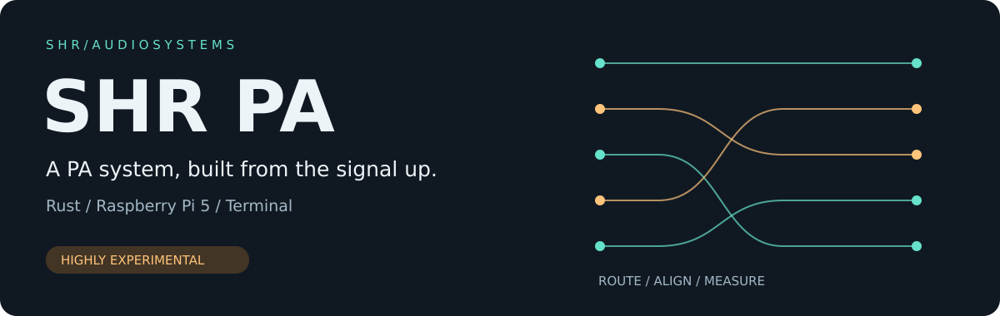
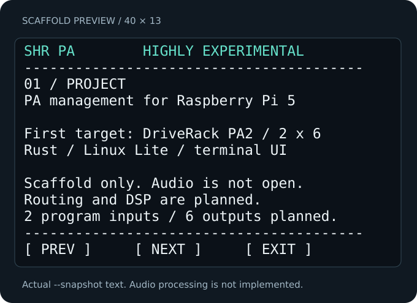

# SHR PA

**Experimental Rust PA management for Raspberry Pi 5 and Linux.**

[](https://github.com/PaolaShultz/shr-pa/actions/workflows/ci.yml)

[Run commands](docs/RUNNING.md) · [Status](docs/STATUS.md) · [DSP behavior](docs/DSP.md) · [Roadmap](docs/ROADMAP.md) · [Hardware](docs/HARDWARE.md)

SHR PA is a hardware-independent **2-input × 6-output** processor:
LR24 full-range/two-way/phase-compensated three-way layouts, mono selection/bass
summing, 31-band GEQ, bell/shelf PEQ, stereo-linked compression, delays,
gain/polarity, ramped mutes, linked peak limiters and meters.
Six-channel offline WAV rendering works without an audio interface. Direct ALSA
runs selected logical outputs on the physical channels available today, with no
implicit stereo mixdown.

The connected AudioBox USB 96 has exercised the stereo path. **UMC1820 is a future
target, not a development prerequisite.** Analog latency and speaker protection
are unmeasured; no loopback is connected. See the [bench record](docs/verification/0003-engine.md).

## Build and run

Requires Linux, Rust **1.97.1** via rustup, a C linker, `pkg-config` and ALSA headers
(`libasound2-dev` on Debian/Ubuntu).

```sh
cargo build --release --locked
./target/release/shr-pa init preset.json
./target/release/shr-pa render preset.json sweep six-outputs.wav 5 --unmute
./target/release/shr-pa
```

The default terminal is an offline preset editor with real DSP previews, not a
hardware stream. Use Tab/arrows and footer mouse buttons for pages; `q` exits.
`s`/`l` save/load `preset.json`; `r` renders a preview; `1`…`6` toggle logical mutes.
The compact layout is **40×13**. Terminal state is restored on handled exits.



## Explicit live operation

```sh
./target/release/shr-pa devices
# Substitute the selected ALSA card ID. Starts muted; u unmutes, q stops.
./target/release/shr-pa live preset.json \
  hw:CARD=CARD_ID,DEV=0 hw:CARD=CARD_ID,DEV=0 \
  2 2 0,1 0,1,-,-,-,- 10 --ui
```

Maps are zero based. The six entries select physical outputs for
H-L/H-R/M-L/M-R/L-L/L-R; `-` leaves a logical output unmapped. All six DSP outputs
still run and remain renderable offline. Invalid physical mappings fail locally.
Live controls use prepared transactions and bounded transitions for gain, polarity,
EQ, dynamics and delays. Tab opens module controls; `v` selects a module, `n` a
parameter and `x`/`X` edits it. Layout/recall uses mute/reconfigure/resume.
Presets use schema v2; `migrate OLD NEW` explicitly converts v1 files. [Full instructions](docs/RUNNING.md).

## Remaining scope

The [complete PA2 function inventory](docs/DRIVERACK_MAP.md) still tracks GEQ curves/restore,
extended crossover/limiter modes, subharmonic synthesis, feedback suppression, measurement/RTA,
AutoEQ/setup workflows, preset/profile management, remote controls and maintenance.
These remain planned or partial, rather than being presented as implemented.
There is no claim of proprietary dbx algorithm equivalence.

General matrices, advanced routing, eight-point positional RTA and the later
nine-channel arrangement remain [future work](docs/FUTURE.md).

[Validation and test policy](docs/VALIDATION.md) · [Contributing](CONTRIBUTING.md)

Built independently of related [SHR DAW](https://github.com/PaolaShultz/shr-daw),
[SHR FX](https://github.com/PaolaShultz/shr-fx) and
[SHR Rec](https://github.com/PaolaShultz/shr-rec) projects.
MIT licensed. Documentation artwork is original. Vendor marks belong to their
owners; SHR PA is an independent project.
