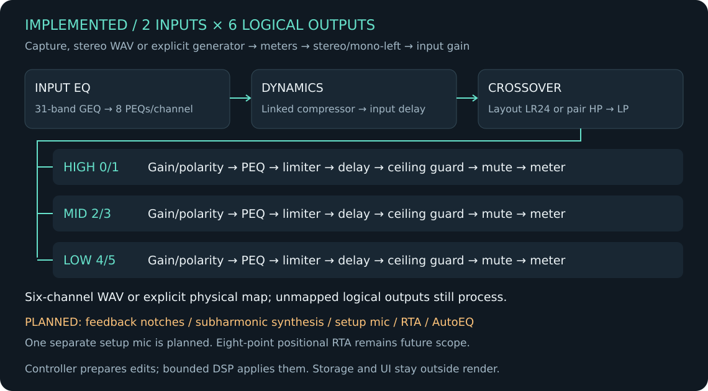

# Architecture — fixed 2×6 processor

**Implemented 0.2 alpha architecture, with planned extensions identified below.**
The actual processing/transport contracts are in [DSP](DSP.md) and [running](RUNNING.md).
The main diagram shows the implemented path. Feedback, bass synthesis and
measurement remain planned extensions.
GEQ, bell/shelf PEQ, compression and independent BW/LR crossover edges are
implemented; see [DSP](DSP.md). Layout LR24 preserves the compensated three-way
tree; independent mode uses fixed per-pair HP/LP cascades without a routing graph.
Processing v3 and library/working v2 envelopes have explicit source-preserving
migration, including EQ history and both working/saved baselines.
The [function map](DRIVERACK_MAP.md) defines the PA2 baseline and the
[roadmap](ROADMAP.md) its implementation sequence.

## Signal path

Two program inputs and six logical outputs are implemented. A separate setup
microphone is in the function plan; there is no microphone/analysis path yet.



```text
Mapped capture / offline WAV / explicit generated source
  -> input meters -> stereo or mono-left -> input gain
  -> 31-band GEQ -> 8 input PEQs/channel -> linked compressor -> input delay
  -> layout LR24 tree OR independent pair HP -> LP
       HIGH L/R -> gain/polarity -> PEQ -> limiter -> delay -> guard -> mutes -> meters
       MID  L/R -> gain/polarity -> PEQ -> limiter -> delay -> guard -> mutes -> meters
       LOW  L/R -> gain/polarity -> PEQ -> limiter -> delay -> guard -> mutes -> meters
  -> six-channel WAV OR explicit logical-to-physical playback map
```

Stereo band settings are paired; filter/delay state and output mutes are per
logical channel. All six outputs process even with only two physical outputs.
Inactive logical outputs and unused physical playback channels are zero.
Unmapped logical outputs retain their processing and meters.

The [PA2 function plan](DRIVERACK_MAP.md) follows its manual's processing order
(printed p. 60). Future feedback notches follow input PEQ, and subharmonic mix
precedes compression. A separate setup mic will feed analysis only; bounded
program taps will feed feedback detection. Neither path exists in 0.2 alpha.
The current generator replaces input before metering/processing. Its optional
−60…0 dBFS peak level is validated and prepared on the controller. Live edits
use a separate atomic latest-gain target and a 5 ms sample ramp. An independent
on/off target crossfades between the selected source and mapped capture over
5 ms; the source clock continues while off. Source, on/off and level stay outside
processing transactions and persistence. Saved presets
never start it. See [exact DSP semantics](DSP.md).

## Boundaries

| Component | Responsibility | Timing |
| --- | --- | --- |
| Audio host | ALSA duplex, conversion, clock/timing and faults | One synchronous audio thread |
| DSP core | Fixed configuration, EQ/crossover, dynamics, delays and generator | Same thread and block |
| Control | Validate commands, prepare parameters, presets and setup state | Outside real time |
| Analysis (planned) | One-mic RTA/measurement, EQ fitting and feedback detection | Workers using bounded taps |
| Interface | Local terminal/mouse; physical touch and remote client planned | Independent of audio deadlines |

The DSP is implemented in the library, separate from transport and terminal work. The control boundary
should support later engine/client separation for remote operation. Do not add
a network server, async runtime or general graph compiler to this first slice.

## Transport and latency

Negotiate capture and playback independently: their native formats and channel
counts can differ. Convert into preallocated storage, run the complete processing
chain, convert and submit playback. Process the required roles even when the USB
endpoint exposes extra channels. Logical output processing never depends on physical channel count.
Confirm socket mappings for whichever card is attached; UMC1820 is future work.

No asynchronous queue or extra ping-pong pipeline sits between DSP stages. USB
and ALSA transport buffers still exist and must be measured. Parameter handoff
and analysis storage do not add an audio block. Use the
[ALSA PCM contract](https://www.alsa-project.org/alsa-doc/alsa-lib/pcm.html) for
negotiation, partial transfers, mmap capability and xrun states. USB feedback is
a device transport property, independent of the application's synchronous DSP.

At 48 kHz, 32/64/128 frames are approximately 0.667/1.333/2.667 ms per period.
These are deadlines, not measured analog latency. Loopback must include converters,
USB queueing, processing and any enabled delays/lookahead. Publish baseline latency
with intentional delay settings separately. No operating buffer is approved yet.

## Render and optimization contract

- Allocate, size and touch every audio/filter/delay buffer before activation.
- No allocation/free, blocking lock, file/network/terminal work or formatted log
  in render. Bound processor count and parameter commands per block.
- Prepare and validate coefficients off-thread. Use safe transitions; bound and
  benchmark any temporary parallel filter evaluation during an edit.
- Reclaim replaced control state outside render. A full queue reports backpressure.
- Meter snapshots and analysis taps have fixed capacity. A slow client or FFT
  worker may lose telemetry, never hold the audio thread.
- Reject non-finite/out-of-range parameters. Define numerical faults, xruns,
  disconnects and clock loss without silently bypassing output protection.

For the future feedback implementation, the processing budget includes 62 GEQ sections, 16 input
PEQ sections, 48 output PEQ sections, and 24 notch instances when the 12 feedback
filters are applied to both program channels. Add actual crossover sections,
subharmonic filters, envelopes and conversions. Count enabled work and benchmark
that configuration, including worst supported crossover slopes and parameter edits.
These include planned filters. Current counts and transition bounds are in
[DSP transactions](DSP.md#transactions-and-transitions); none of these counts
establish measured CPU usage.

Start scalar with contiguous storage. Design coefficients in f64, compare f32/f64
state accuracy and speed on the Pi, and handle denormals deliberately. Optimize
measured hot loops; consider NEON across independent channels/sections where the
data dependency allows it. Do not use floating-point assumptions that remove
finite checks. Profile analysis and UI separately; cap their update rate.

A proposed initial gate is worst observed processing time under 50% of the period
with the acceptance workload. Record maxima/distributions and xruns. Evaluate
real-time scheduling, locked memory, affinity, IRQ placement and cooling from
measurements; investigate PREEMPT_RT if the standard kernel cannot meet deadlines.

## State, persistence and recovery

The implementation uses a validated fixed schema, atomic JSON save/load, runtime
mutes outside presets and explicit restart on audio faults. Prepared transactions now support live parameter edits through a single atomic
slot. Related edits begin together at block boundaries, with bounded transitions
and preserved unrelated state. Topology edits/recalls use mute/reconfigure/resume.
The controller now also owns the 75-slot local library, immutable templates,
EQ restore history and independent atomic working-state recovery. A library lock
serializes local editors; corrupt or incompatible working files are retained and
block further working writes until explicitly archived. Recovery is processing-only
and startup-muted. See [persistence details](DSP.md#library-and-working-state).
The rest of this section includes longer-term preferences, profiles and recovery targets.

For future setup/profile support, extend the versioned schema explicitly. Planned
presets will also contain setup selections and profile references. RTA preferences
and utility/access settings will be global; current mutes are runtime-only. Working edits can be recovered without overwriting saved presets.
Apply related settings as a validated transaction at a block boundary; incompatible
configuration changes use a defined mute/reconfigure/resume transition.

Plan startup-muted, ready, active and fault states. Show recovery next to the
fault and preserve edited work. Reconnection revalidates device identity, format
and channel map. The configured startup mute policy must not override a runtime
fault. Test signals always stop on cancel/fault and never resume from a saved preset.

Remote/local commands share validation, permission and revision checks. A client
reconnect reads the current engine state before writing. UI disconnection and
engine death have different policies; establish them before the P8 split.
A software mute cannot guarantee analog silence after USB/power/process failure;
bench those cases before making any physical protection claim.
